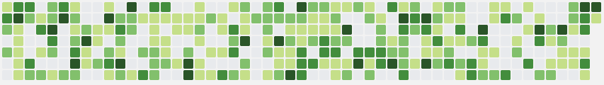
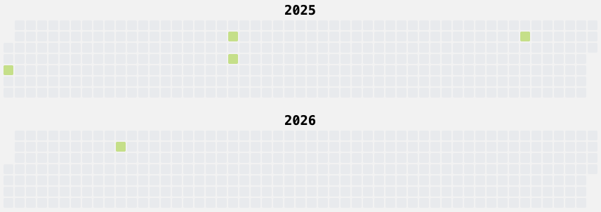
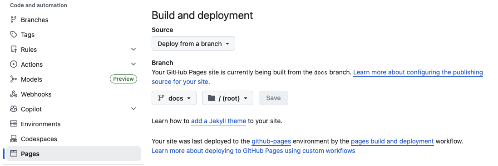
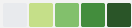
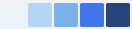
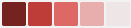

## Trackalendar 🗓️

It is a calendar heatmap that shows the number of events that happened on each day.

Deployed in your Github Pages.

it can be used to track your habits, projects, or anything you want to log. I use it for my sex life:

### Example

See the demo published in GitHub Pages with random dates: https://angel-git.github.io/trackalendar/

### Usage

1. Fork this repo.
2. Enable Github pages in the settings, set the source to `docs` branch:

3. Run `log.sh` (or `log.ps1` if you are on Windows (I haven't tested myself...)) to log an event, events are stored in `events.txt`, each line contains a date that something happened, you can log multiple events on the same day.
   - If you missed some day, you can add ` -d YYYY-MM-DD` as argument into the script or you can also edit the `events.txt` file directly, just make sure to follow the format.
4. Commit and push your changes.
5. A Github action will generate the html page and publish it to GitHub Pages from the `docs` branch.

### Configuration

You can customize the configuration in `config.toml`, here are the available options:
- `title`: The title of the page.
- `theme`: The colors of the heatmap, from 0 to 4 events per day:
  - `Green` 
  - `GreenReverse` 
  - `Blue` 
  - `BlueReverse` 
  - `Red` 
  - `RedReverse` 

Once is configured commit and push your changes

### TODO

- [x] Parse the entries file
- [x] Generate the html page
- [x] Add a switch between examples and prod data
- [x] Publish to GitHub Pages
- [x] Support mobile
- [x] Windows scripts
- [x] Customize heatmap colors and threesholds
- [ ] Light/dark mode support